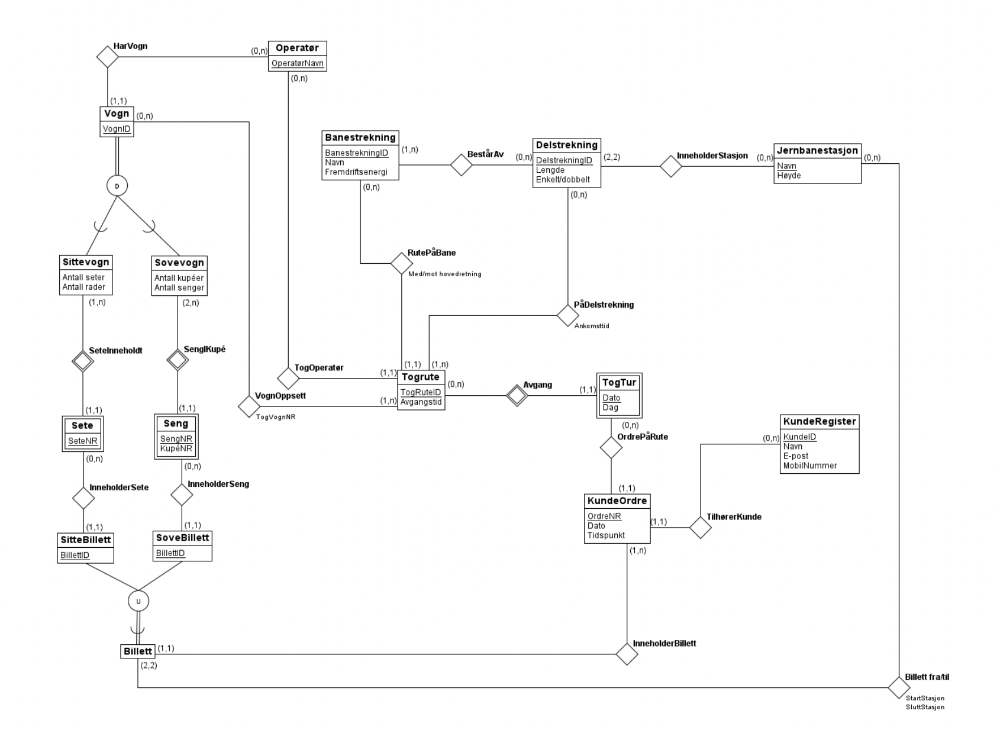

# ER-diagram

  
# Tabeller

### __Banestrekning__(BanestrekningID, Navn, Fremdriftsenergi, Retning)
- Her er BanestrekningID supernøkkel, og alle felter av funksjonelt avhengig av denne, dermed 4NF.
  

### __InneholderStrekninger__(BanestrekningID, DelstrekningID)
- BanestrekningID er fremmednøkkel mot Banestrekning-tabellen
- DelstrekningID er fremmednøkkel mot Delstrekning-tabellen
- Her er det ingen funksjonelle avhengigheter eller MVD-er, dermed automatisk 4NF.
  

### __Delstrekning__(DelstrekningID, Lengde, Enkelt/Dobbelt, StartStasjon, SluttStasjon)
- StartStasjon er fremmednøkkel mot Jernbanestasjon-tabellen
- Sluttstasjon er fremmednøkkel mot Jernbanestasjon-tabellen
  
- Her vil DelstrekningID og (StartStasjon,SluttStasjon) være supernøkler for tabellen, disse inngår på venstre side i alle funksjonelle avhengigheter, og dermed er tabellen på 4NF.
  

### __Jernbanestasjon__(Navn, Høyde)
- Navn er supernøkkel for denne tabellen, og den eneste funksjonelle avhengigheter vi har er 
Navn -> Høyde, dvs. 4NF.
  

### __PåDelstrekning__(TogruteID, DelstrekningID, AnkomstTid)
- TogruteID er fremmednøkkel mot Togrute-tabellen
- DelstrekningID er fremmednøkkel mot Delstrekning-tabellen
- (TogruteID, DelstrekningID) er supernøkkel, eneste funksjonelle avhengighet er (TogruteID, DelstrekningID) -> AnkomstTid, dermed er tabellen på 4NF. 
  

### __Togrute__(TogruteID, OperatørNavn, AvgangsTid, BanestrekningID) 
- OperatørNavn er fremmednøkkel mot Operatør-tabellen
- BanestrekningID er fremmednøkkel mot Banestrekning-tabellen
- TogruteID blir supernøkkel, alle felter er funksjonelt avhengige av denne, dermed 4NF.
  

### __TogTur__(Dato, TogruteID, Dag)
- TogruteID er fremmednøkkel mot Togrute-tabellen
- Her blir (Dato TogruteID) supernøkkel, Dag er funksjonelt avhengig av denne, dette er også kun eneste funksjonelle avhengighet, dermed 4NF.
  

### __KundeOrdre__(OrdreNR, Dato, Tidspunkt, KundeID)
- KundeID er fremmednøkkel mot KundeRegister-tabellen
- OrdreNR vil være supernøkkel for tabellen, alle felter er funksjonelt avhengig av denne, dermed 4NF. 
  

### __KundeRegister__(KundeID, Navn, Epost, Mobilnummer)
- KundeID er supernøkkel for tabellen og denne gir entydig alle andre attributter i tabellen, ingen andre funksjonelle avhengigheter, dermed 4NF.
  

### __Operatør__(OperatørNavn)
- Ingen funksjonelle avhengigheter, dermed 4NF.
  

### __Vogn__(VognID, OperatørNavn)
- OperatørNavn er fremmednøkkel mot Operatør-tabellen
- VognID blir supernøkkel, VognID -> OperatørNavn er eneste funksjonelle avhengighet. Dermed er Vogn på 4NF. 
  

### __Sete__(SeteNR, VognID)
- VognID er fremmednøkkel mot Vogn-tabellen
- Ingen funksjonelle avhengigheter, dermed 4NF.
  

### __Seng__(SengNR, VognID, KupéNR) 
- VognID er fremmednøkkel mot Vogn-tabellen
- (SengNR,VognID) supernøkkel, vi har (SengNR, VognID) -> KupéNR, dermed 4NF. Ellers ingen andre funksjonelle avhengigheter.
  

### __Billett__(BillettID, VognID, OrdreNR, StartStasjon, SluttStasjon, SeteNR, SengNR)
- OrdreNR er fremmednøkkel mot KundeOrdre-tabellen
- StartStasjon er fremmednøkkel mot Jernbanestasjon-tabellen
- SluttStasjon er fremmednøkkel mot Jernbanestasjon-tabellen
- SeteNR er fremmednøkkel mot Sete-tabellen (NULL når ikke bestilt)
- SengNR er fremmednøkkel mot Seng-tabellen (NULL når ikke bestilt)
- VognID er fremmednøkkel mot Vogn-tabelen, siden både Sete og Seng er svake, trengs den identifiserende entiteten også. På denne måten finner vi riktig instans av sete/seng i den gitte vogna.
  
- Vi har en MVD i OrdreNR ->> BillettID. Denne antar vi er triviell, og spiller ikke inn på normalformen. Vi har valgt å ikke endre på tabellen, ettersom vi ser det hensiktsmessig å beholde den slik, spesielt på grunn av alle fremmednøklene som knytter hele systemet sammen, dette vil føre til færre joins i SQL-koden, og det fremstår lite hensiktsmessig å splitte den opp mer.
Tabellen er dermed fortsatt på 4NF, men dersom MVD-en ikke anses som triviell, er den på BCNF, siden OrdreNR ikke er supernøkkel i tabellen, BillettID er.
  

### __VognOppsett__(VognID, TogruteID, TogVognNR)
- VognID er fremmednøkkel mot Vogn-tabellen
- TogruteID er fremmednøkkel mot Togrute-tabellen
  

- (VognID, TogruteID) er supernøkkel, dette gir TogVognNR, dermed 4NF, ellers ingen andre funksjonelle avhengighet.

### __OrdrePaRute__(OrdreNR, Dato, TogruteID)
- 
  
